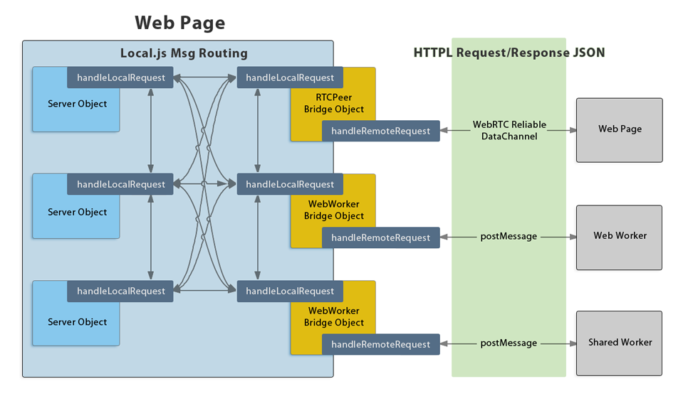

Local 0.4.0dev
==============

[<a href="https://github.com/grimwire/local">Repository</a> | <a href="https://github.com/grimwire/local/issues">Issues</a> | <a href="http://grimwire.com/local">Documentation</a>]

## Overview

Local.js is an Ajax-to-anywhere messaging library for Web applications. It sends HTTP-style messages to functions in the document, Web Workers, WebRTC Peers, data URIs, and public Web servers, structuring the components of the application into a unified SOA.

 - Promises-based Ajax library with support for streams
 - Server-Sent Event APIs for distributed updates
 - A programmatic user-agent for navigating via link headers

Local.js can be used with [Grimwire](https://github.com/grimwire/grimwire), a node.js "Peer Relay", to establish sessions between apps for WebRTC.

### Examples

Run servers in the document:

```javascript
local.addServer('foobar', function(req, res) {
    res.writeHead(200, 'ok', { 'content-type': 'text/plain' })
    res.end('Hello, world!');
});
local.dispatch({ method: 'GET', url: 'httpl://foobar' }).then(handle2or3xx, handle4or5xx);
```

Run servers in Web Workers:

```javascript
local.spawnWorkerServer('http://myhost.com/myworker.js');
local.dispatch({ method: 'GET', url: 'httpl://myworker.js' }).then(/* ... */);
```

Run servers for other users on Grimwire:

```javascript
// Get access to the relay
var relay = local.joinRelay('https://grimwire.net', peerServerFn);
relay.requestAccessToken(); // this will prompt the user to authorize the app
relay.on('accessGranted', function() {
    peerRelay.startListening();
});

// Serve peers
function peerServerFn(req, res, peer) {
    res.writeHead(200, 'ok', { 'content-type': 'text/plain' })
    res.end('Hello, '+peer.getPeerInfo().user);
}

// Contact peers on the relay
local.dispatch({ method: 'GET', url: 'httpl://bob@grimwire.net!bobs-app.com' })
    .then(/* ... */);
```

<br/>

## How it works

The core of Local.js is a message router which adds a new scheme, `httpl://`, for targeting requests at functions within the application. These in-app server functions work similarly to node.js servers, and support streaming for requests and responses. Special types of server functions, the `bridge` servers, serialize the streams into JSON and transport them over channels to other namespaces.



This diagram illustrates how Local.js' HTTPL messages are routed. Note: any time a bridge server receives a request from within its own application, it pipes that request directly to its remote environment to be fulfilled. Likewise, a request that arrives from the remote environment is handled by the bridge server and sent directly back.

 > Read more in the <a href="#docs/web/dispatch.md">dispatch()</a> documentation.

### Server-Sent Events

SSE streams are responses which remain open for a long period to deliver updates in named chunks. They can be used with HTTP and HTTPL to broadcast realtime events.

> Read more in the <a href="#docs/web/subscribe.md">subscribe()</a> documentation.

```javascript
var events = local.subscribe('httpl://ssehost');
events.on('foo', function(e) { console.log(e); }) // => { event: "foo", data: ... }
events.on('bar', function(e) { console.log(e); }) // => { event: "bar", data: ... }
```

### Programmatic Navigation

The `local.Agent` is similar to a headless browser or a database cursor that travels Web APIs. It issues HEAD requests to hosts, then runs queries against the returned Link headers to navigate. The navigation queries allow applications to reason about remote hosts and make strong assumptions based on reltypes. This protocol is outlined in the [Web Linking spec](http://tools.ietf.org/html/rfc5988).

> Read more in the <a href="#docs/web/agent.md">agent()</a> documentation.

```javascript
// Register an in-document server:
local.addServer('foo', function(req, res) {
    if (req.path == '/') {
        res.writeHead(200, 'ok', {
            'content-type': 'text/plain',
            'link': [
                { href: '/', rel: 'self service' },
                { href: '/bar', rel: 'item', id: 'bar' }
            ]
        });
        res.end('Hello from /');
    } else if (req.path == '/bar') {
        res.writeHead(200, 'ok', {
            'content-type': 'text/plain',
            'link': [
                { href: '/', rel: 'up service' },
                { href: '/bar', rel: 'self item', id: 'bar' }
            ]
        });
        res.end('Hello from /bar');
    } else {
        res.writeHead(404, 'not found').end();
    }
});

// Create an agent for the server and dispatch a GET:
var fooAPI = local.agent('httpl://foo');
fooAPI.get().then(/* ... */); // => "Hello from /"

// Navigate by searching the link header of the response:
var fooBarItem = fooAPI.follow({ rel: 'item', id: 'bar' });
fooBarItem.get().then(/* ... */); // => "Hello from /bar"

// Follow the "up" link back to the root:
fooBarItem.follow({ rel: 'up' }).get().then(/* ... */); // => "Hello from /"
```

<br/>

## Getting Started

Download <a href="//github.com/grimwire/local">local.js or local.min.js from the repository</a>. If you're developing for Grimwire, download <a href="//github.com/grimwire/grimwire">grimwidget.js from the Grimwire repo</a> and read the documentation on <a href="#docs/grimwire.md">Using Grimwire</a>.

For an introduction to writing Local.js apps, read <a href="#docs/todosoa.md">Intro: TodoSOA</a>.

### BETA STATUS

The Local.js and Grimwire APIs are not feature-stable. <a href="//github.com/grimwire/local/issues">Suggestions and bug reports are welcome</a>.

<br/>

## Misc

### Special thanks and credits

Thank you to the following third-party library authors:

 - [**parseUri**](http://stevenlevithan.com/demo/parseuri/js/), Stephen Levithan
 - [**UriTemplate**](https://github.com/fxa/uritemplate-js), Franz Antesberger
 - [**Prism**](https://github.com/LeaVerou/prism), Lea Verou
 - [**Marked**](https://github.com/chjj/marked), Christopher Jeffrey

Special thanks to [Goodybag.com](http://goodybag.com) for their support during the development of this project. If you're in Austin and need food delivered to the office, be sure to check out their website.

### License

The MIT License (MIT)
Copyright (c) 2013 Paul Frazee

Permission is hereby granted, free of charge, to any person obtaining a copy of this software and associated documentation files (the "Software"), to deal in the Software without restriction, including without limitation the rights to use, copy, modify, merge, publish, distribute, sublicense, and/or sell copies of the Software, and to permit persons to whom the Software is furnished to do so, subject to the following conditions:

The above copyright notice and this permission notice shall be included in all copies or substantial portions of the Software.

THE SOFTWARE IS PROVIDED "AS IS", WITHOUT WARRANTY OF ANY KIND, EXPRESS OR IMPLIED, INCLUDING BUT NOT LIMITED TO THE WARRANTIES OF MERCHANTABILITY, FITNESS FOR A PARTICULAR PURPOSE AND NONINFRINGEMENT. IN NO EVENT SHALL THE AUTHORS OR COPYRIGHT HOLDERS BE LIABLE FOR ANY CLAIM, DAMAGES OR OTHER LIABILITY, WHETHER IN AN ACTION OF CONTRACT, TORT OR OTHERWISE, ARISING FROM, OUT OF OR IN CONNECTION WITH THE SOFTWARE OR THE USE OR OTHER DEALINGS IN THE SOFTWARE.
